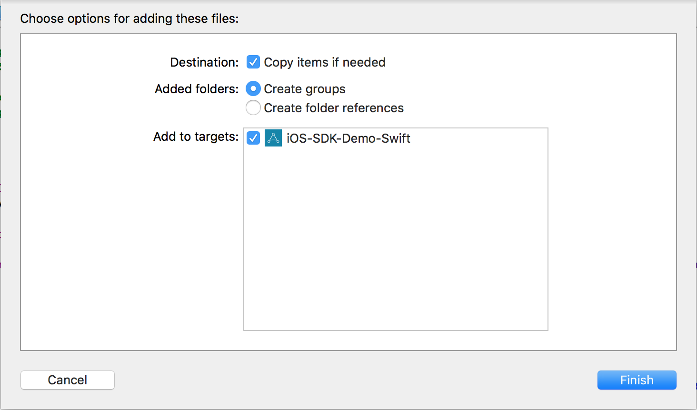

iOS-Demo-App
============

These are our open source demo applications in both Objective-C and Swift. You may re-use any code in your own project(s). If you have any questions, feel free to drop us a line at support@applovin.com.

# Instructions #

## Manual Integration ##

1. Download the latest SDK from https://applovin.com.

2. Drag-and-drop `AppLovinSDK.framework` into the `Frameworks` folder of the SDK Demo app.

  Check off "Copy items if needed"
  

3. Add your AppLovin SDK key into the `Info.plist` under `AppLovinSdkKey` row

## Cocoapods ##

Each SDK Demo App folder has a `Podfile` that specifies the `AppLovinSDK` dependency.

1. Run the following on the command line in the same path as the `Podfile` to install the latest `AppLovinSDK.framework`.

`pod install --repo-update`

2. Open the .xcworkspace file to open the project in Xcode.

3. Add your AppLovin SDK key into the `Info.plist` under `AppLovinSdkKey` row
